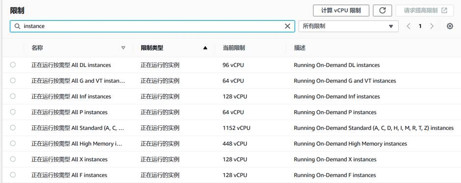
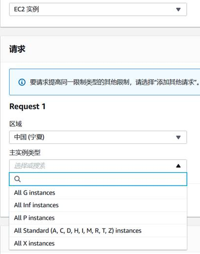
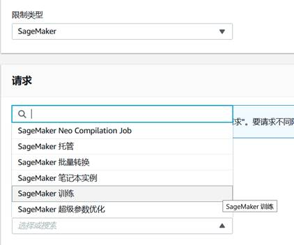

#########################################
准备工作
#########################################

.. contents::

**************************
limitation的申请
**************************

准备工作
您本身的EC2或SageMaker中的instance是有vCPU的额度限制的，为了使用更多的机器，您可能需要提交一个工单申请提升您的vCPU限制。

=================================
1. EC2 vCPU限制提升的步骤
=================================

1)       在控制台的搜索框中搜索“EC2”，点击进入“EC2”的控制面板

2)       在控制面板的左侧找到“限制”（“Limits”）选项，并点击

3)       在“限制”的搜索框中搜索“instance”，就可以看到您目前EC2 vCPU的限制情况，如下图：

|Image13:|

4)       机器学习一般会用到G系列或P系列的实例，请根据您的实际需求选择名称之后通过“请求提高限制”进行申请，这样您就会转到控制台的工单页面。选择好“区域”之后，对实例类型进行选择。在“描述”文本框中请详细描述开通机器限制的原因，这样会有助于我们更快速地帮助您提高限制。海外区域可以填写中文内容

|Image14:|

5)       提交工单之后，根据您support支持计划的等级，会有不同的响应时间，请您耐心等待。

=================================
2. SageMaker训练限制提升的步骤
=================================

这个步骤会帮助您提升SageMaker中前缀为“ml.”的机器。

1)       点击控制台右上角的“支持”选项，进入“支持控制面板”

2)       选择“提高服务限制”

3)       选择“限制类型”为“SageMaker”，选择“请求类型”为“SageMaker训练”

|Image15:|

4)       在“描述”文本框中请详细描述开通SageMaker限制的原因，这样会有助于我们更快速地帮助您提高限制。海外区域可以填写中文内容

如遇到问题，请第一时间联系您的客户经理。更多细节可以参考：

1)       如何提升EC2 vCPU的限制：

https://aws.amazon.com/cn/premiumsupport/knowledge-center/ec2-on-demand-instance-vcpu-increase/

2)       EC2机型配置详细信息（中国区）：

https://www.amazonaws.cn/ec2/instance-types/

3)       EC2机型配置详细信息（海外区）：

https://aws.amazon.com/cn/ec2/instance-types/

**************************
实验环境的准备
**************************

-   建议尝试下使用动手实验部分的 EC2 进行深度学习，按文档指引分配好资源后，使用方式和标准jupyter一样。
-   建议温习下Pytorch的mnist代码，在动手实验时比较下SageMaker做了哪些封装，封装思路也适用于其他框架。

