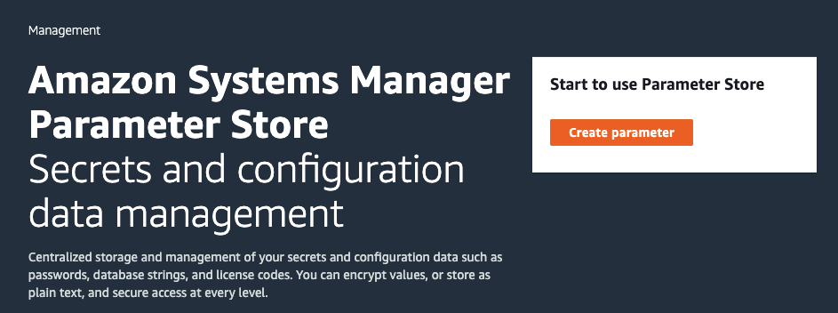

#########################################
使用 EC2 进行深度学习
#########################################

您可以使用我们提供的 CloudFormation 模板，快速创建一台拥有 NVidia V100 GPU 的 **P3** 实例，并使用 Jupyter Notebook 开始您的深度学习过程。
我们目前提供中国宁夏区域的部署模板。

.. contents::

**************************
添加账单通知邮箱
**************************

为了避免您的账单超出预期，我们在 CloudFormation 模板中设置了一个费用告警，当月费用达到 RMB10000 的 70%，也即 7000元时，会往您提供的邮箱中发送一封邮件。邮箱地址需要先添加到 Amazon Systems Manager 的 Parameter Store 中。
以下展示如何添加邮箱地址到 Parameter Store。

打开 Amazon Systems Manager
=================================

|Image1:|

创建一个 Parameter
=================================

|Image2:|

填写邮箱地址
=================================
Parameter 名称必须是 **email**，在 **Value** 中填入邮箱地址，其它保持默认。

|Image3:|

**************************
部署 CloudFormation 模板
**************************

下载 CloudFormation 模板
=================================

右键点击 `这个地址 <https://www.kiking.team/CdkMlStack.template.json>`__，将其另存为，保存到本地计算机。

在 CloudFormation 控制台部署 CloudFormation 模板
==================================================================

打开 `宁夏区域 CloudFormation 控制台 <https://cn-northwest-1.console.amazonaws.cn/cloudformation>`__， 创建一个 Stack。

|Image4:|

选择模板文件
=================================

选择 **Upload a template file**，选择刚下载的模板文件。

|Image5:|

指定 Stack 名称
=================================

给 Stack 指点一个方便记忆的名称。其它不变。

|Image6:|

确定提交
=================================

保持默认选项，一直选择 **Next**，在最后的 Review 页面，勾选 *I acknowledge that Amazon CloudFormation might create IAM resources*。然后点击 **Create Stack**。等待部署完成。

|Image7:|

**************************
访问 EC2 实例
**************************

打开 Session Mangager
=================================

回到 Amazon Systems Manager，打开 Session Manager，开始一个 Session。

|Image8:|

在实例列表中，选中名为 **DeepLearning** 的实例，点击 Start Session

|Image9:|

切换到 ubuntu 用户
=================================

会在一个新标签名中打开 Shell 窗口，在提示符后输入以下命令切换到 **ubuntu** 用户, 并切换到用户所在的目录。

.. code:: bash

    sudo su ubuntu
    cd ~

添加 SSH 公钥
=================================
在您的个人电脑上生成SSH密钥对，可以全部默认，拷贝。

.. code:: bash

    ssh-keygen -t rsa

执行成功后，找到命令行提示的地址，
    Your public key has been saved in /Users/xxx/.ssh/id_rsa.pub.

在上一步打开的网页Shell窗口中，修改 **authorized_keys** 文件，把您的 SSH 公钥（id_rsa.pub内容）添加到其中，每个公钥一行。

.. code:: bash

    nano ~/.ssh/authorized_keys

修改 Jupyter Notebook 密码
=================================

执行以下命令，连续输入两次相同密码

.. code:: bash

    jupyter notebook password

正确设置后，会告知密码保存位置：

.. code:: 

    Enter password:
    Verify password:
    [NotebookPasswordApp] Wrote hashed password to /home/ubuntu/.jupyter/jupyter_notebook_config.json

启动 Jupyter Notebook
=================================

建议在一个 **tmux** 进程中启动 Jupyter Notebook

.. code:: bash

    tmux
    jupyter notebook 

连接到 Jupyter Notebook
=================================

以 macOS 为例，用生成的私钥来登录，将远程的jupyter的8888端口映射到本地的8080端口。

.. code:: bash

    cd /Users/xxx/.ssh
    ssh -i id_rsa -N -f -L 8080:localhost:8888 ubuntu@EC2公网地址

确认 SSH 连接到 EC2。然后在浏览器地址栏输入 http://127.0.0.1:8080 打开 Jupyte Notebook。输入刚设置的密码，您就可以开始使用 Jupyter Notebook 了。

|Image10:|

更多 Deep Learning AMI 的介绍，请参考 `这里 <https://docs.aws.amazon.com/dlami/latest/devguide/what-is-dlami.html>`__

**************************
删除资源
**************************
测试完毕后，回到 CloudFormation 控制台页面，选中 **DeepLearning** 这个 Stack，点击 **Delete** ，所有资源即可被清除。

.. |Image3:| image:: ../../_static/images/3.png

.. |Image6:| image:: ../../_static/images/6.png
.. |Image7:| image:: ../../_static/images/7.png
.. |Image8:| image:: ../../_static/images/8.png

.. |Image10:| image:: ../../_static/images/10.png